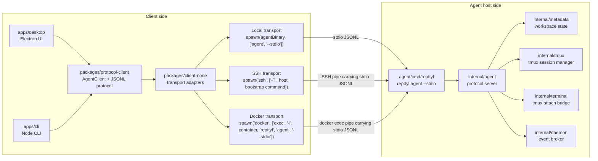
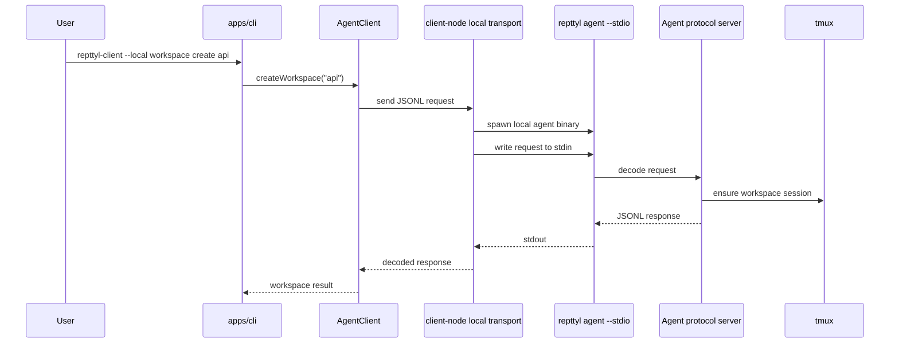
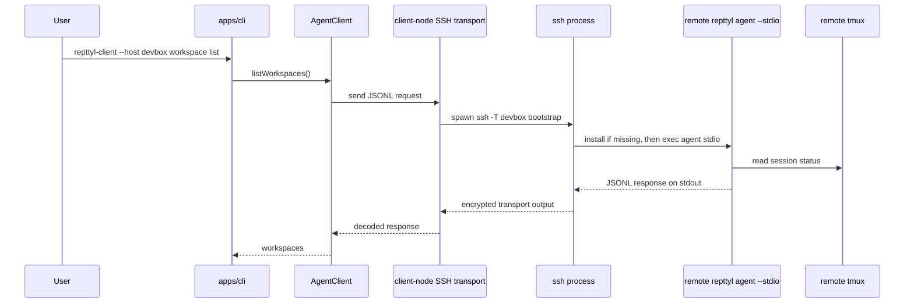
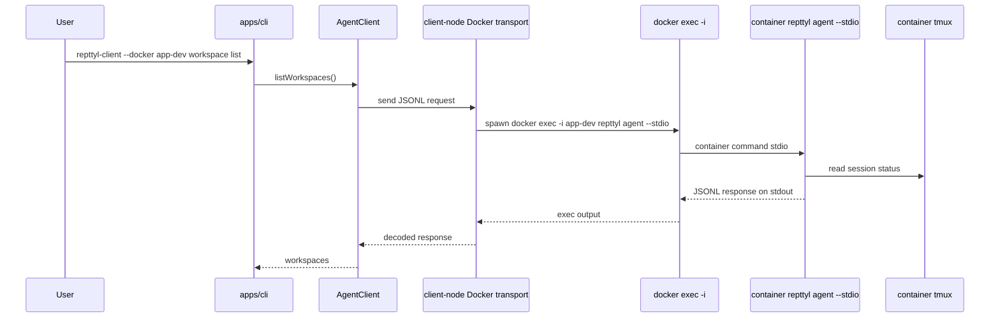
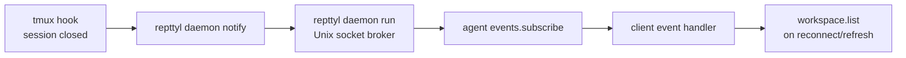

# Repttyl Architecture Diagrams

This document separates transport ownership from agent ownership.

The client owns transport. The agent only speaks the Repttyl JSON-lines protocol over stdin/stdout after it has been started.

## Responsibility Boundary

## Local Transport

Local mode is a client-side adapter. It starts the agent as a child process on the same machine and then uses that child process stdin/stdout as the protocol pipe.

## SSH Transport

SSH mode is also a client-side adapter. The client starts `ssh`; SSH runs a remote bootstrap command that uses `repttyl` when available or installs it from the GitHub release into `~/.local/bin/repttyl`. The Repttyl protocol is still the same stdin/stdout JSON-lines stream after the agent starts.

## Docker Transport

Docker mode is a client-side adapter. The client starts `docker exec -i`; Docker runs `repttyl agent --stdio` inside an already-running container. The agent still owns tmux inside that container.

## Terminal Attach Data Path

The client never controls tmux directly. It asks the agent to attach a terminal stream. The agent owns tmux socket paths, session names, resizing, input forwarding, and output forwarding.

```mermaid
flowchart LR
  UserInput["User keystrokes"]
  ClientUI["CLI or desktop terminal view"]
  Protocol["AgentClient\nstream input/resize messages"]
  Transport["client-node transport\nlocal, SSH, or Docker"]
  Agent["repttyl agent --stdio"]
  Attach["internal/terminal.Attachment"]
  TmuxSocket["workspace tmux socket"]
  Shell["workspace shell"]

  UserInput --> ClientUI
  ClientUI --> Protocol
  Protocol --> Transport
  Transport -- "JSONL stream messages" --> Agent
  Agent --> Attach
  Attach --> TmuxSocket
  TmuxSocket --> Shell
  Shell --> TmuxSocket
  TmuxSocket --> Attach
  Attach --> Agent
  Agent -- "JSONL output messages" --> Transport
  Transport --> Protocol
  Protocol --> ClientUI
```

## Daemon Event Path

The daemon is not a transport layer. It is an agent-host event broker used for status notifications from tmux hooks. Reconnect/refresh still uses `workspace.list` as the authoritative on-demand state check.

## Current Ownership Summary

| Concern | Owner |
| --- | --- |
| Choose local vs SSH vs Docker transport | Client (`apps/cli`, later `apps/desktop`) |
| Spawn local agent process | `packages/client-node` local transport |
| Spawn SSH process | `packages/client-node` SSH transport |
| Spawn Docker exec process | `packages/client-node` Docker transport |
| Run `repttyl agent --stdio` | Agent binary, after the client starts it |
| Encode/decode JSON-lines protocol | `packages/protocol-client` and Go agent server |
| Workspace metadata | Agent |
| tmux sessions and sockets | Agent |
| Terminal stream input/output bridge | Agent |
| tmux hook notifications | Agent-side daemon |
