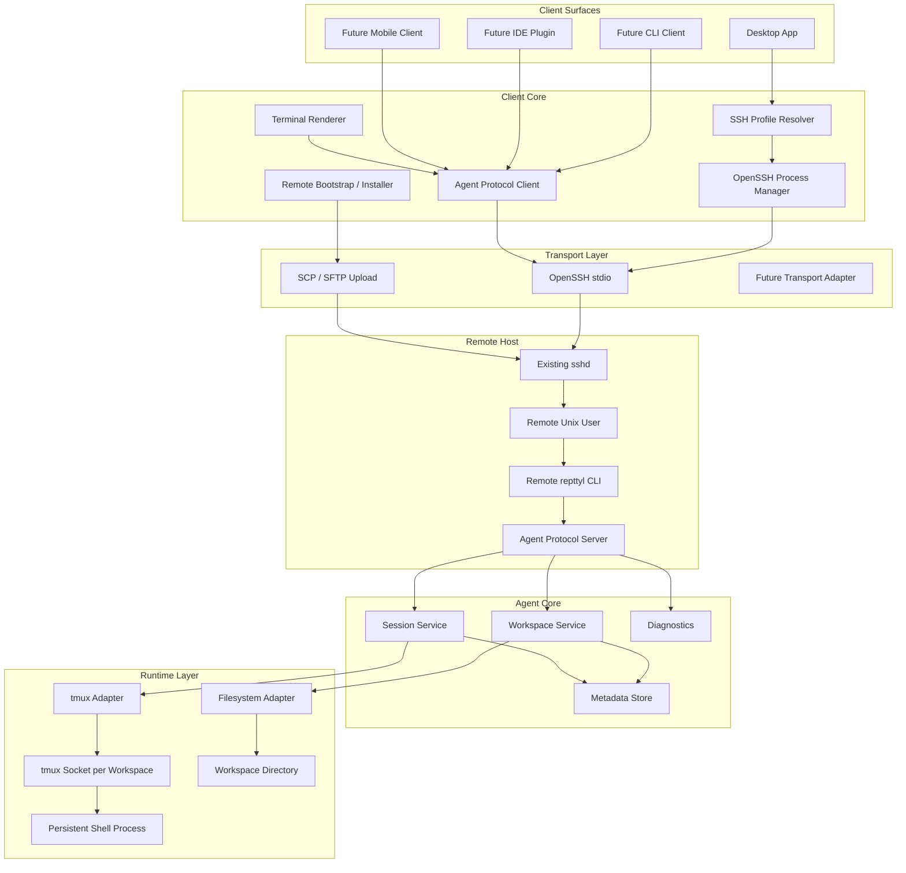
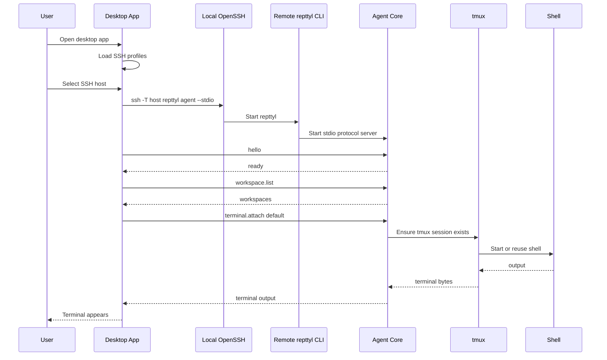
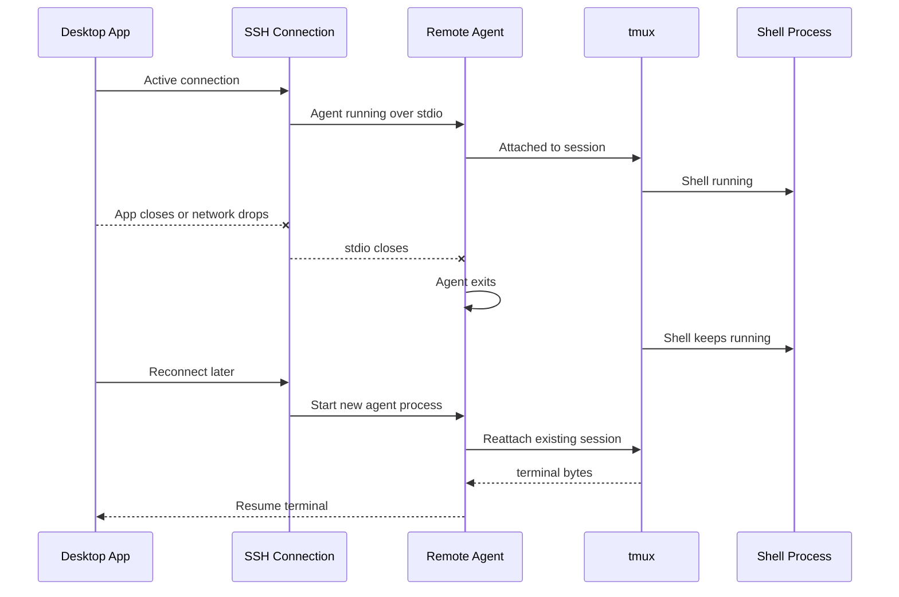
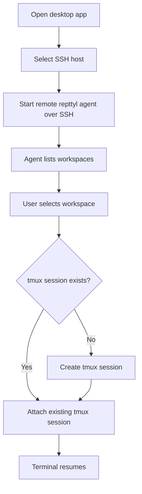
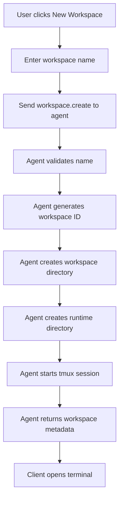
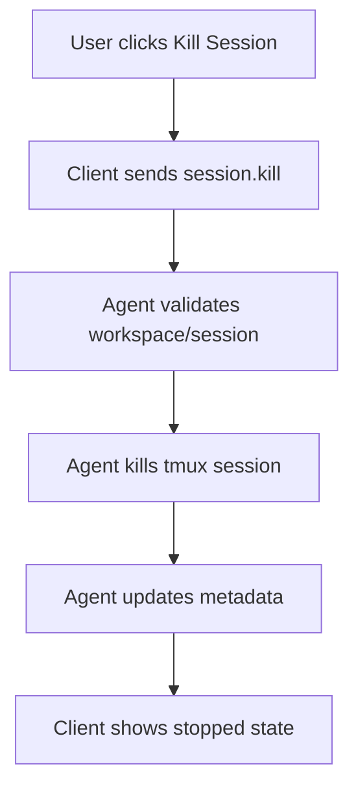
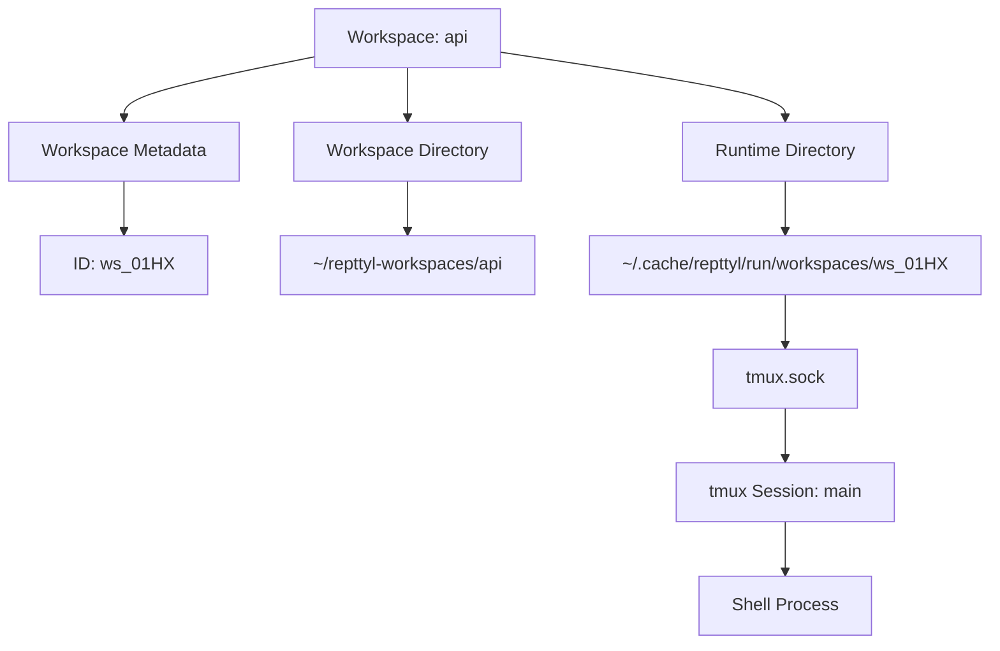
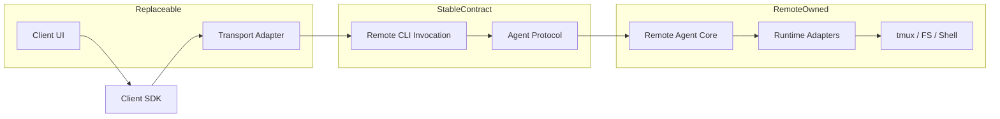
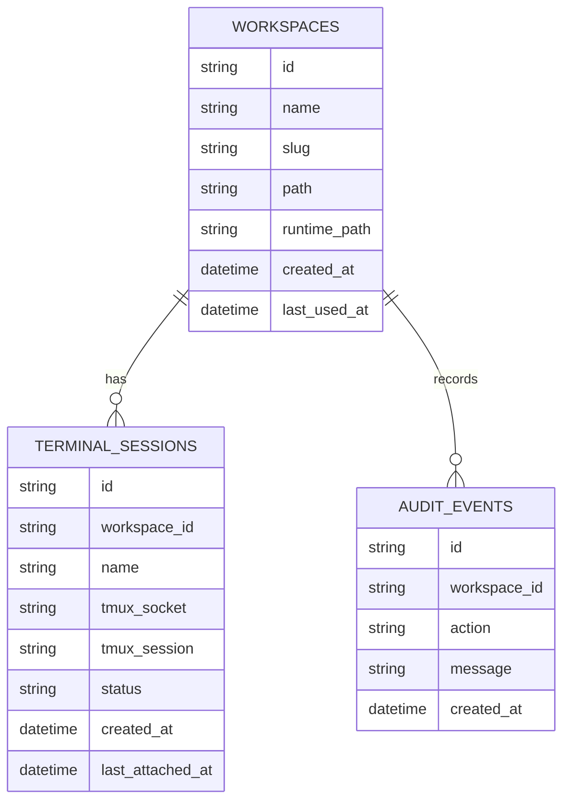

# HANDOFF.md

## Project Name

**Repttyl**

Pronunciation: **REP-til**

Concept:

```text
remote + PTY + TTY + reptile
```

Recommended public naming:

```text
Product: Repttyl
Domain: repttyl.com
CLI binary: repttyl
Remote agent command: repttyl agent --stdio
Workspace root: ~/repttyl-workspaces
Install root: ~/.local/share/repttyl
Runtime root: ~/.cache/repttyl/run
```

## Project Summary

Build a **desktop-first remote shell workspace system** inspired by the UX of VS Code Remote SSH, but focused only on terminal sessions.

The product lets a user select an existing SSH profile from their local machine, connect using local OpenSSH, start a remote `repttyl` CLI/agent under the SSH user, and attach to persistent tmux-backed shell workspaces.

The system must be layered so future clients can be added later. The first client is the desktop app.

## Core Product Definition

A layered, client-extensible remote shell workspace system where:

- SSH is transport only.
- The desktop app uses the user's existing OpenSSH setup.
- The desktop app does not run arbitrary Unix commands directly.
- All remote control goes through the remote `repttyl` CLI/agent.
- The remote agent abstracts filesystem, tmux, and shell operations.
- tmux is the persistence layer.
- Remote shells persist across client disconnects.
- Web client / HTTPS API is out of scope for now.

## Current Design Decision

The correct model is:

```text
Desktop App
  -> Client SDK
    -> OpenSSH Transport Adapter
      -> ssh -T <host> repttyl agent --stdio
        -> Remote repttyl CLI
          -> Agent Protocol Server
            -> Workspace Service
            -> Session Service
            -> tmux Adapter
              -> Persistent tmux Session
                -> Remote Shell
```

## Explicit Non-Goals

Do not build these in the current scope:

- Web client
- HTTPS API
- Browser terminal
- Web-over-SSH-tunnel
- Central hosted control plane
- Central user management
- Dedicated remote `repttyl` Unix user
- OpenSSH `ForceCommand`
- Custom SSH server
- Root/system-wide install requirement
- Direct remote shell command execution from desktop
- File explorer
- Code editor
- LSP
- Debugger
- VS Code extension host
- Multi-user SaaS platform
- Billing
- Kubernetes orchestration

## Important Architectural Constraint

The desktop app must **not** do this:

```bash
ssh host 'ls ~/.local/share/repttyl'
ssh host 'uname -s -m'
ssh host 'tmux list-sessions'
ssh host 'mkdir -p ...'
ssh host 'cat ...'
```

Instead, all remote operations must go through the `repttyl` CLI/agent contract:

```bash
ssh -T host 'repttyl agent --stdio'
```

Then the desktop communicates with the agent using the agent protocol.

Optional discrete commands may exist, but they must still be `repttyl` commands:

```bash
ssh -T host 'repttyl version --json'
ssh -T host 'repttyl doctor --json'
ssh -T host 'repttyl probe --json'
```

The key boundary:

```text
Client controls: OpenSSH process + protocol messages.
Remote agent controls: OS inspection, filesystem, tmux, shell, metadata.
```

## Persistence Semantics

tmux must persist shell state after disconnect.

Expected behavior:

| Event | Expected Result |
|---|---|
| Desktop app closes | tmux keeps running |
| SSH connection drops | tmux keeps running |
| Remote agent exits | tmux keeps running |
| User reconnects | new agent process reattaches existing tmux session |
| Workspace session is killed | tmux session is killed |
| Remote machine reboots | tmux does not survive by default |

Important:

```text
The remote agent is disposable.
tmux is durable.
```

The agent can start and exit repeatedly. The shell stays alive because tmux remains alive.

## Layered Architecture



## Product Layers

### 1. Client Surface Layer

Initial client:

- Desktop app

Future clients:

- CLI client
- IDE plugin
- Mobile/tablet client
- Automation client

All clients should use the same client SDK and agent protocol.

### 2. Client Core Layer

Responsibilities:

- Read local SSH profiles.
- Let user select SSH host.
- Use local OpenSSH.
- Start remote `repttyl agent --stdio`.
- Speak the agent protocol.
- Render terminal streams.
- Handle reconnect.
- Send resize/input events.
- Receive terminal output events.

### 3. Transport Layer

Initial transport:

```text
OpenSSH stdio
```

The desktop should start the remote agent like:

```bash
ssh -T <host> 'repttyl agent --stdio'
```

SSH is not the API. SSH is the pipe.

### 4. Remote CLI / Agent Layer

The remote `repttyl` binary is the remote API boundary.

It provides:

- command mode
- stdio agent mode

Command mode examples:

```bash
repttyl version --json
repttyl doctor --json
repttyl probe --json
repttyl workspace list --json
```

Agent mode:

```bash
repttyl agent --stdio
```

### 5. Runtime Layer

The remote agent owns all direct interactions with:

- filesystem
- tmux
- shell processes
- metadata
- runtime directories
- logs
- diagnostics

Clients must not bypass the agent to directly control tmux or Unix.

## User Flow: First Connection



## User Flow: Disconnect and Resume



## User Flow: Open Existing Workspace



## User Flow: Create Workspace



## User Flow: Kill Workspace Session



## Remote Workspace Model

A workspace is a named remote shell environment.

Recommended mapping:

```text
Workspace display name: api
Workspace ID: ws_01HX...
Workspace path: ~/repttyl-workspaces/api
Runtime path: ~/.cache/repttyl/run/workspaces/ws_01HX
tmux socket: ~/.cache/repttyl/run/workspaces/ws_01HX/tmux.sock
tmux session: main
```

Use one tmux socket per workspace.



## Remote Install Layout

Preferred user-local install layout:

```text
~/.local/share/repttyl/
  versions/
    0.1.0/
      repttyl
    0.1.1/
      repttyl
  current -> versions/0.1.1
  state/
    repttyl.db
  logs/
    agent.log

~/.cache/repttyl/
  run/
    workspaces/
      ws_abc123/
        tmux.sock

~/repttyl-workspaces/
  default/
  api/
  infra/
```

## Bootstrap Strategy

There are two acceptable bootstrap modes.

### Mode A: Strict Preinstall Mode

User manually installs `repttyl` on the remote host.

The desktop only runs:

```bash
ssh -T host 'repttyl agent --stdio'
```

This is architecturally cleanest.

### Mode B: Desktop-Managed Install

The desktop uploads the `repttyl` binary via SCP/SFTP and then invokes it.

Even in this mode, the desktop should not run arbitrary Unix commands beyond invoking the `repttyl` binary.

Preferred remote invocation after install:

```bash
ssh -T host '~/.local/share/repttyl/current/repttyl agent --stdio'
```

For v1, strict preinstall mode is simpler and cleaner. Desktop-managed install can be added later.

## Protocol Design

Start with JSON Lines over SSH stdio.

Each message is one JSON object followed by newline.

### Handshake

Client:

```json
{"id":1,"op":"hello","client_version":"0.1.0"}
```

Agent:

```json
{"id":1,"ok":true,"agent_version":"0.1.0","protocol_version":"0.1"}
```

### Workspace List

Client:

```json
{"id":2,"op":"workspace.list"}
```

Agent:

```json
{"id":2,"ok":true,"workspaces":[{"id":"ws_default","name":"default","status":"running"}]}
```

### Workspace Create

Client:

```json
{"id":3,"op":"workspace.create","name":"api"}
```

Agent:

```json
{"id":3,"ok":true,"workspace":{"id":"ws_01HX","name":"api","path":"~/repttyl-workspaces/api"}}
```

### Terminal Attach

Client:

```json
{"id":4,"op":"terminal.attach","workspace_id":"ws_01HX","cols":120,"rows":40}
```

Agent:

```json
{"id":4,"ok":true,"stream":"term_01HX"}
```

### Terminal Input

Client:

```json
{"stream":"term_01HX","op":"input","data":"npm run dev\n"}
```

### Terminal Output

Agent:

```json
{"stream":"term_01HX","op":"output","data":"Server running\n"}
```

### Terminal Resize

Client:

```json
{"stream":"term_01HX","op":"resize","cols":140,"rows":42}
```

### Session Kill

Client:

```json
{"id":5,"op":"session.kill","workspace_id":"ws_01HX","session":"main"}
```

Agent:

```json
{"id":5,"ok":true}
```

### Error Shape

Agent:

```json
{"id":6,"ok":false,"error":{"code":"WORKSPACE_NOT_FOUND","message":"Workspace not found"}}
```

## Future Protocol Upgrade

JSON Lines is acceptable for MVP.

Later, upgrade to binary framing for terminal performance:

```text
uint32 length
uint8 frame_type
bytes payload
```

Frame types:

```text
1 = rpc_json
2 = terminal_input
3 = terminal_output
4 = resize
5 = heartbeat
6 = error
```

## Remote Agent Responsibilities

The remote agent must:

- Start over stdio.
- Handle protocol handshake.
- Manage workspace metadata.
- Create/list/delete workspaces.
- Create/list/kill terminal sessions.
- Attach to tmux-backed terminals.
- Send terminal output to client.
- Receive terminal input from client.
- Handle terminal resize.
- Keep tmux alive after disconnect.
- Exit cleanly when stdio closes.
- Recover from stale socket paths.
- Avoid shell interpolation.
- Own all filesystem and tmux operations.

## Client Responsibilities

The desktop app must:

- Read existing SSH profiles.
- Let user select a host.
- Use OpenSSH to connect.
- Start `repttyl agent --stdio`.
- Speak the agent protocol.
- Render terminal.
- Send input and resize events.
- Receive output events.
- Handle reconnect.
- Show workspace list.
- Show session status.
- Warn when connecting as root if detectable.
- Never directly call remote Unix commands for control.

## Component Boundaries



Stable contracts:

- `repttyl agent --stdio`
- agent protocol messages
- workspace/session abstractions

Replaceable:

- desktop app
- future CLI client
- future IDE plugin
- transport implementation

Remote-owned internals:

- tmux command details
- filesystem layout
- metadata format
- socket naming
- stale runtime cleanup

## Suggested Repository Structure

```text
repttyl/
  package.json
  pnpm-workspace.yaml
  nx.json

  apps/
    desktop/
      package.json
      forge.config.ts
      src/
        main/
        preload/
        renderer/
        ssh-profile-resolver/
        ssh-process-manager/
        protocol-client/
        terminal-ui/
        host-manager/
        workspace-ui/

    cli/
      package.json
      src/
        main.ts

  packages/
    protocol-client/
      package.json
      src/

    protocol-schema/
      package.json
      schema/
        messages.json
      docs/
        protocol.md

  agent/
    go.mod
    cmd/
      repttyl/
        main.go

    internal/
      protocol/
      workspace/
      session/
      tmux/
      fsruntime/
      metadata/
      diagnostics/
      logging/

  docs/
    HANDOFF.md
    ARCHITECTURE.md
    PRD.md
```

This structure assumes:

- package management uses pnpm workspaces
- task orchestration and project graph use Nx
- desktop app is TypeScript + Electron Forge
- backend / remote agent is Go
- protocol schema is shared/documented

Alternative frontend implementation details are acceptable, but the backend / remote agent must remain Go and the protocol boundary should remain the same.

## Recommended Tech Choices

Current recommendations:

```text
Package manager: pnpm workspaces
Monorepo orchestration: Nx
Desktop framework: Electron Forge
Desktop language: TypeScript
Terminal renderer: xterm.js
Transport: local OpenSSH process
Backend language: Go
Remote agent language: Go
Persistence: tmux
Workspace metadata: SQLite or JSON initially
Runtime root: ~/.cache/repttyl/run
State root: ~/.local/share/repttyl/state
Workspace root: ~/repttyl-workspaces
Protocol v1: JSON Lines over SSH stdio
```

## Security Rules

Required security rules:

- Do not interpolate untrusted strings into shell commands.
- Use argument arrays when executing local or remote subprocesses.
- Workspace names must be validated and slugged.
- Internal IDs must be generated.
- User-facing names must not become raw tmux session names.
- tmux socket paths must be under the controlled runtime root.
- Runtime directories should use restrictive permissions.
- Do not expose a public web service in the current scope.
- Do not require sudo.
- Do not install system-wide by default.
- Do not bypass SSH authentication.
- Do not store raw private keys.
- Respect existing OpenSSH behavior and known_hosts validation.

## tmux Design

Use one tmux socket per workspace.

Example internal command executed by the remote agent only:

```bash
tmux -S "$socket" new-session -d -s main -c "$workspace_path" "$shell"
```

Attach internally through the agent's PTY bridge.

The client must never directly send tmux commands.

The agent should expose abstract operations instead:

```text
terminal.attach
terminal.resize
terminal.input
session.kill
workspace.list
workspace.create
```

## Workspace Name Rules

Workspace display names can be user-friendly, but internal runtime identifiers must be generated.

Example:

```text
Display name: api
Slug: api
Workspace ID: ws_01HX8Y...
tmux session name: main
tmux socket path: ~/.cache/repttyl/run/workspaces/ws_01HX8Y/tmux.sock
```

Invalid workspace names should return structured errors.

## Metadata Model

Minimal remote metadata:



Local desktop metadata may store:

```text
host alias
last connected time
last selected workspace
display preferences
root warning acknowledgment
```

Remote metadata stores:

```text
workspaces
sessions
paths
runtime state
agent version
logs
```

## MVP Requirements

### P0

The MVP must support:

- Desktop app launch.
- Existing SSH profile selection.
- Manual SSH target entry.
- OpenSSH-based connection.
- Starting remote `repttyl agent --stdio`.
- JSON Lines protocol.
- Workspace list.
- Workspace create.
- Workspace attach.
- Workspace kill.
- tmux-backed persistent shell sessions.
- Terminal input/output.
- Terminal resize.
- Reconnect and resume.
- Basic remote metadata.
- Basic diagnostics.
- No web dependency.
- No direct Unix command control from desktop.

### P1

Should support:

- Multiple terminal tabs.
- Recent hosts.
- Recent workspaces.
- Agent install/update flow.
- Root-user warning.
- Clean uninstall.
- Scrollback capture on reconnect.
- Stale runtime cleanup.
- Host-specific settings.
- Agent logs viewer.

### P2

Later:

- CLI client.
- IDE plugin.
- Session templates.
- Port detection.
- Resource usage display.
- Session restore after reboot.
- Optional encrypted metadata.
- Binary protocol framing.
- Desktop-managed install.

## MVP Acceptance Criteria

The MVP is complete when:

```text
[ ] User can open desktop app.
[ ] App can list or accept SSH profiles.
[ ] User can select an SSH host.
[ ] App connects through local OpenSSH.
[ ] App starts remote repttyl using `repttyl agent --stdio`.
[ ] App completes protocol handshake.
[ ] Agent returns workspace list.
[ ] User can create a workspace.
[ ] User can open a terminal.
[ ] User can run a long-running command.
[ ] User can close the app.
[ ] tmux session keeps running.
[ ] User can reopen app and reconnect.
[ ] Agent reattaches to same tmux session.
[ ] User can kill a workspace session.
[ ] Terminal resize works.
[ ] No HTTPS API exists.
[ ] No web client exists.
[ ] No dedicated remote Unix account is required.
[ ] Desktop does not run arbitrary remote Unix commands for control.
```

## Root User Handling

If the SSH profile connects as root, the app should warn:

```text
You are connecting as root.
The remote Repttyl agent and all shells will run as root on this host.
Continue?
```

Do not block by default.

This is user-controlled SSH access.

## Open Questions

Resolve before or during implementation:

1. Should v1 require preinstalled `repttyl`, or include desktop-managed install?
2. Should metadata be SQLite or JSON files for the first version?
3. Should each workspace have exactly one tmux session named `main`, or multiple named sessions?
4. Should terminal tabs map to tmux windows, panes, or separate sessions?
5. Which Go module layout and release build pipeline should the backend use?
6. Which Electron Forge maker targets are required for the first release?
7. Should Windows remote hosts be unsupported initially?
8. Should scrollback be captured from tmux on reconnect?
9. Should the agent exit immediately when the client disconnects, or stay alive briefly for fast reconnect?
10. Should SSH ControlMaster be used by the desktop to reduce connection overhead?

## Recommended Decisions

Recommended defaults:

```text
Package manager: pnpm workspaces
Monorepo orchestration: Nx
Backend language: Go
Remote agent language: Go
Desktop framework: Electron Forge
Desktop language: TypeScript
Terminal renderer: xterm.js
Transport: OpenSSH stdio
Protocol v1: JSON Lines
Persistence: tmux
Metadata v1: SQLite if convenient, JSON if speed matters
Workspace root: ~/repttyl-workspaces
Runtime root: ~/.cache/repttyl/run
Install root: ~/.local/share/repttyl
One tmux socket per workspace
One default tmux session per workspace
No web
No HTTPS API
No direct Unix command control from desktop
```

## First Implementation Milestone

Build the remote agent locally first.

Target local command:

```bash
repttyl agent --stdio
```

Then manually send protocol messages to test:

```json
{"id":1,"op":"hello","client_version":"0.1.0"}
{"id":2,"op":"workspace.list"}
{"id":3,"op":"workspace.create","name":"default"}
{"id":4,"op":"terminal.attach","workspace_id":"ws_default","cols":120,"rows":40}
```

Expected result:

- agent creates workspace metadata
- agent creates tmux socket directory
- agent starts tmux session
- agent streams terminal output
- killing the client leaves tmux alive
- restarting the agent can reattach

## Second Implementation Milestone

Add desktop OpenSSH transport.

Target:

```text
Desktop app -> local OpenSSH -> ssh -T host repttyl agent --stdio
```

Desktop should:

- spawn local `ssh`
- write protocol messages to stdin
- read protocol messages from stdout
- render terminal output
- pass keyboard input to agent
- handle reconnect

## Third Implementation Milestone

Add real workspace UI.

Desktop should show:

```text
Host picker
Workspace list
Create workspace
Open workspace terminal
Kill workspace session
Reconnect status
```

## Final One-Line Summary

Build **Repttyl**: a desktop-first, OpenSSH-native remote shell workspace app where the local client uses SSH only as transport, controls the remote environment exclusively through a `repttyl` CLI/agent protocol, and relies on tmux to persist shell sessions across disconnects.
